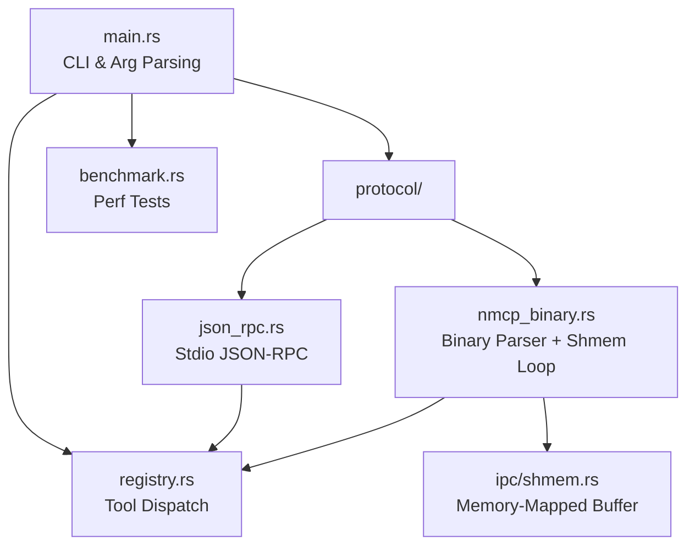
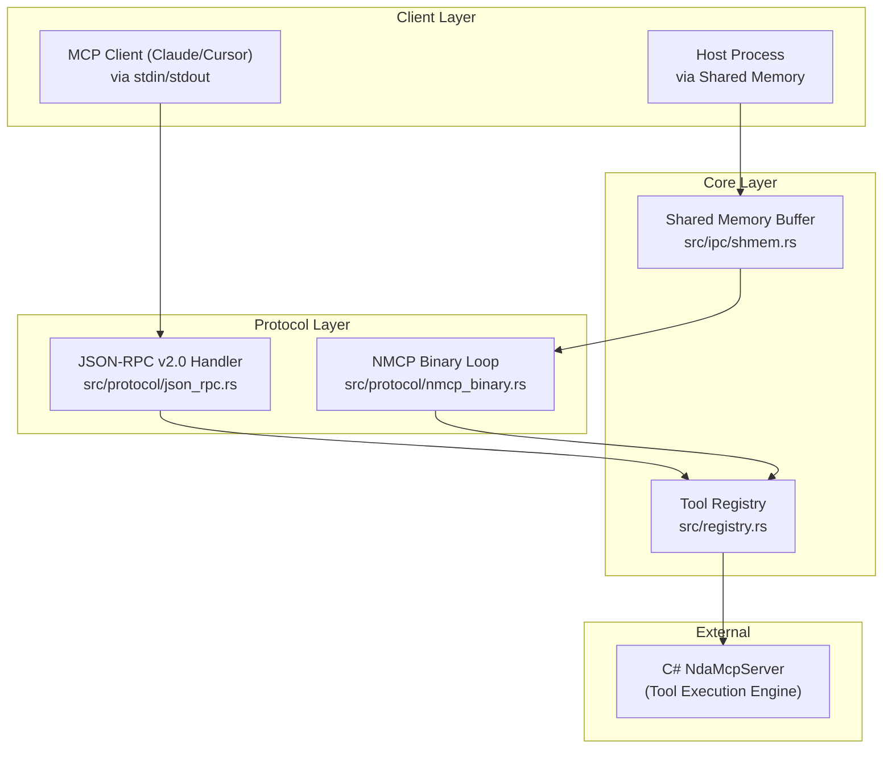

# Getting Started

<cite>
**Referenced Files in This Document**
- [README.md](file://README.md)
- [Cargo.toml](file://Cargo.toml)
- [src/main.rs](file://src/main.rs)
- [LICENSE](file://LICENSE)
</cite>

## Table of Contents
1. [Introduction](#introduction)
2. [Project Structure](#project-structure)
3. [Core Components](#core-components)
4. [Architecture Overview](#architecture-overview)
5. [Installation and Setup](#installation-and-setup)
6. [Running the Server](#running-the-server)
7. [Running Benchmarks](#running-benchmarks)
8. [Troubleshooting](#troubleshooting)

## Introduction

V.E.L.O.C.I.T.Y. NMCP Server is a high-performance, zero-allocation Model Context Protocol (MCP) server written in Rust. It is designed to replace slow, bloated Node.js/Python MCP servers with a highly optimized, self-contained executable. The server offers a dual-protocol execution mode:

1. **Stdio JSON-RPC v2.0 Mode** — Full compatibility with standard MCP clients (Claude Desktop, Cursor, custom IDE plugins). Uses zero-allocation JSON string slicing via `serde_json`.
2. **Shared Memory Mode** — Zero-copy IPC via memory-mapped files with atomic-controlled ring buffers. Host and client read/write binary NMCP frames with Merkle signatures directly in shared memory, eliminating stdout pipeline latency and JSON parsing overhead entirely.

## Project Structure

The repository is a single Rust crate (not a workspace):

```text
V.E.L.O.C.I.T.Y.-MCP/
├── src/
│   ├── main.rs              # CLI entry point & argument parsing (92 LOC)
│   ├── registry.rs          # Tool registration & C# sandbox routing (136 LOC)
│   ├── benchmark.rs         # In-memory execution performance tests (74 LOC)
│   ├── protocol/
│   │   ├── mod.rs           # Protocol module declarations (3 LOC)
│   │   ├── json_rpc.rs      # Stdio JSON-RPC v2.0 handler (113 LOC)
│   │   └── nmcp_binary.rs   # Zero-alloc binary parser + shmem loop (141 LOC)
│   └── ipc/
│       ├── mod.rs           # IPC module declarations (2 LOC)
│       └── shmem.rs         # Memory-mapped file & ring buffer (117 LOC)
├── Cargo.toml               # Dependencies: serde, serde_json, memmap2, sha2, once_cell
├── LICENSE                  # Proprietary Namibian license
└── README.md                # Project documentation
```



**Diagram source**
- [src/main.rs](file://src/main.rs)
- [src/protocol/mod.rs](file://src/protocol/mod.rs)
- [src/ipc/mod.rs](file://src/ipc/mod.rs)

## Core Components

| Module | Role | Key Entry Points |
|--------|------|------------------|
| `main.rs` | CLI argument parsing, mode dispatch | `main()`, `print_help()` |
| `protocol::json_rpc` | Stdio JSON-RPC v2.0 request loop | `run_stdio_loop()` |
| `protocol::nmcp_binary` | Shared memory polling loop + binary frame parser | `run_shmem_loop()`, `NmcpBinaryFrame::parse()` |
| `ipc::shmem` | Memory-mapped file buffer with state machine | `SharedMemoryBuffer::create_or_open()` |
| `registry` | Tool definitions and C# delegation | `get_tools()`, `call_tool()` |
| `benchmark` | Performance micro-benchmarks | `run_benchmarks()` |

Key responsibilities:
- **JSON-RPC Handler**: Reads newline-delimited JSON from stdin, dispatches `initialize`, `tools/list`, `tools/call`
- **NMCP Binary Parser**: Zero-allocation frame parsing — 4-byte magic (`NMCP`), 32-byte Merkle root, variable payload
- **Shared Memory IPC**: 64KB memory-mapped file with 5-state machine (Idle → ReqReady → Processing → ResReady → Error)
- **Tool Registry**: Defines 3 NDA tools (convert, read, execute) and delegates execution to C# NdaMcpServer core engine
- **Benchmark Suite**: Compares JSON-RPC parsing, shared memory R/W, and zero-alloc binary parsing latency

## Architecture Overview



## Installation and Setup

### Prerequisites
- **Rust toolchain**: Install via [rustup](https://rustup.rs/). Stable channel required.
- **Windows OS**: The C# NdaMcpServer delegation path is Windows-specific.
- **.NET 10.0 SDK**: Required for the C# core engine at the expected delegation path.

### Build Commands

```powershell
# Debug build
cargo build

# Release build (optimized, stripped, LTO)
cargo build --release

# Run benchmarks
cargo run -- --benchmark
```

The release profile is aggressively optimized:
- `opt-level = 3` (maximum optimization)
- `lto = true` (full link-time optimization)
- `codegen-units = 1` (single codegen unit for best optimization)
- `panic = "abort"` (no unwind tables)
- `strip = true` (no debug symbols)

## Running the Server

### Stdio Mode (Compatible with Cursor/Claude Desktop)

```powershell
./target/release/velocity_mcp --mode stdio
```

This starts the JSON-RPC v2.0 stdio loop. The server reads newline-delimited JSON requests from stdin and writes responses to stdout.

### Shared Memory Mode (High-Performance Zero-Copy)

```powershell
./target/release/velocity_mcp --mode shmem --buffer-path nmcp_buffer.bin
```

This initializes the memory-mapped buffer and enters the shared memory polling loop. The host process writes requests to the shared memory region and the server polls for state changes.

### CLI Options

| Option | Description | Default |
|--------|-------------|---------|
| `--mode <stdio\|shmem>` | Protocol mode | `stdio` |
| `--buffer-path <path>` | Shared memory buffer file path (shmem mode only) | `nmcp_buffer.bin` |
| `--benchmark` | Run performance benchmark suite | — |
| `-h, --help` | Print help screen | — |

## Running Benchmarks

```powershell
cargo run -- --benchmark
```

The benchmark suite measures three operations:
1. **JSON-RPC Parse** (serde_json): 500,000 iterations of parsing a standard MCP request
2. **NMCP Zero-Alloc Binary Parse**: 1,000,000 iterations of binary frame parsing
3. **Shared Memory Mmapped R/W**: 200,000 iterations of write + read through memory-mapped buffer

Reference results (Intel Core i5-14400F):

| Operation | Mean Latency | Speedup vs JSON |
|-----------|:---:|:---:|
| JSON-RPC Parse (serde_json) | 112.59 ns | 1.0x (baseline) |
| Mmapped Buffer R/W | 74.05 ns | 1.52x faster |
| Zero-Alloc Binary Parse | 1.54 ns | 73.1x faster |

## Troubleshooting

- **Build failures**: Ensure Rust stable toolchain is installed (`rustup show`).
- **C# delegation errors**: Verify the NdaMcpServer.exe exists at the expected path. See [Troubleshooting & FAQ](Troubleshooting%20&%20FAQ.md) for details.
- **Shared memory file lock**: Ensure no other process has the buffer file open. Delete the buffer file and restart.

**Section sources**
- [README.md](file://README.md)
- [Cargo.toml](file://Cargo.toml)
- [src/main.rs](file://src/main.rs)
