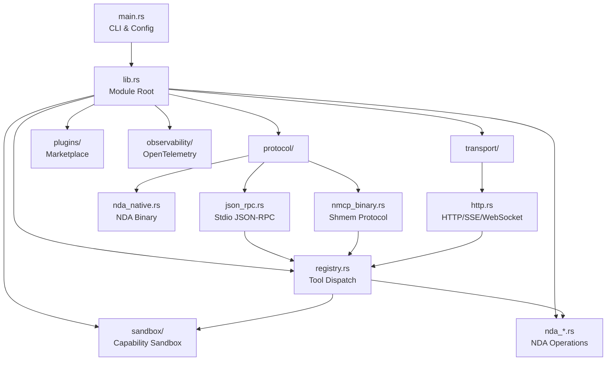
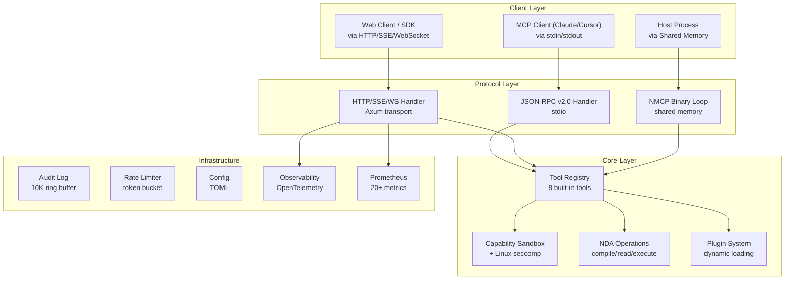

# Getting Started

<cite>
**Referenced Files in This Document**
- [README.md](file://README.md)
- [Cargo.toml](file://Cargo.toml)
- [src/main.rs](file://src/main.rs)
- [docs/USER_GUIDE.md](file://docs/USER_GUIDE.md)
</cite>

## Table of Contents
1. [Introduction](#introduction)
2. [Project Structure](#project-structure)
3. [Core Components](#core-components)
4. [Architecture Overview](#architecture-overview)
5. [Installation and Setup](#installation-and-setup)
6. [Running the Server](#running-the-server)
7. [Running Benchmarks](#running-benchmarks)
8. [Troubleshooting](#troubleshooting)

## Introduction

V.E.L.O.C.I.T.Y. MCP Server v3.0.0 is a high-performance, production-ready Model Context Protocol (MCP) server written in Rust. It replaces slow, bloated Node.js/Python MCP servers with a highly optimized, self-contained executable. The server offers four transport modes:

1. **Stdio JSON-RPC v2.0 Mode** — Full compatibility with standard MCP clients (Claude Desktop, Cursor, custom IDE plugins).
2. **HTTP/SSE Mode** — Full HTTP transport with session management, Server-Sent Events streaming, WebSocket support, Prometheus metrics, and TLS/HTTPS.
3. **WebSocket Mode** — Dedicated bidirectional WebSocket transport for real-time applications.
4. **Shared Memory Mode** — Zero-copy IPC via memory-mapped files with atomic-controlled state machine and NDA binary protocol support.

The server provides **8 built-in tools** (4 general + 4 NDA), all implemented natively in Rust — no external process delegation required. It includes **15+ security layers**, **284 passing tests**, and **cross-platform support** (Windows, Linux, macOS).

## Project Structure

The repository is a single Rust crate with a proc-macro sub-crate:

```text
V.E.L.O.C.I.T.Y.-MCP/
├── src/
│   ├── main.rs              # CLI entry point & argument parsing
│   ├── lib.rs               # Library root with module declarations
│   ├── registry.rs          # Tool registration & dispatch
│   ├── nda_converter.rs     # NDA binary document compiler
│   ├── nda_document.rs      # NDA document parser & reader
│   ├── nda_executor.rs      # NDA payload executor in sandbox
│   ├── sandbox.rs           # Capability-based sandbox
│   ├── sandbox/
│   │   └── linux_seccomp.rs # Linux seccomp-bpf syscall filters
│   ├── audit.rs             # Audit logging (10K ring buffer)
│   ├── rate_limit.rs        # Token bucket rate limiter
│   ├── config.rs            # TOML configuration management
│   ├── error.rs             # Error types and sanitization
│   ├── middleware.rs         # HTTP middleware (auth, CORS, logging)
│   ├── resources.rs         # MCP Resources & Prompts
│   ├── sampling.rs          # MCP Sampling protocol
│   ├── streaming.rs         # Streaming responses with progress
│   ├── oauth2.rs            # OAuth2 connector framework
│   ├── benchmark.rs         # Performance benchmarks
│   ├── protocol/
│   │   ├── mod.rs           # Protocol module declarations
│   │   ├── json_rpc.rs      # Stdio JSON-RPC v2.0 handler
│   │   ├── nmcp_binary.rs   # Shared memory protocol
│   │   └── nda_native.rs    # NDA binary frame protocol
│   ├── transport/
│   │   ├── mod.rs           # Transport module declarations
│   │   └── http.rs          # HTTP/SSE/WebSocket transport (Axum)
│   ├── ipc/
│   │   ├── mod.rs           # IPC module declarations
│   │   └── shmem.rs         # Memory-mapped file buffer
│   ├── plugins/
│   │   ├── mod.rs           # Plugin system
│   │   └── marketplace.rs   # Plugin marketplace
│   └── observability/
│       └── mod.rs           # OpenTelemetry integration
├── macros/                  # Proc-macro crate for type-safe tool registration
├── client/                  # Client SDKs
│   ├── rust/                # Rust client SDK
│   ├── python/              # Python client SDK
│   ├── typescript/          # TypeScript client SDK
│   └── go/                  # Go client SDK
├── docs/                    # Documentation
│   ├── USER_GUIDE.md        # Complete user guide
│   ├── API.md               # API reference
│   ├── DEPLOYMENT.md        # Deployment guide
│   └── MARKETPLACE.md       # Plugin marketplace guide
├── monitoring/              # Prometheus/Grafana configs
├── tests/                   # Integration and fuzz test suites
├── benches/                 # Criterion benchmarks
├── Cargo.toml               # Dependencies and feature flags
└── README.md                # Project documentation
```



## Core Components

| Module | Role | Key Entry Points |
|--------|------|------------------|
| `main.rs` | CLI argument parsing, config loading, mode dispatch | `main()`, `print_help()` |
| `protocol::json_rpc` | Stdio JSON-RPC v2.0 request loop with MCP spec compliance | `run_stdio_loop()` |
| `protocol::nmcp_binary` | Shared memory polling loop + binary frame parser | `run_shmem_loop()` |
| `protocol::nda_native` | NDA-native binary protocol with TLV encoding | NDA frame parse/dispatch |
| `transport::http` | HTTP/SSE/WebSocket transport via Axum | `run_http_loop()` |
| `registry` | Tool definitions and native dispatch | `get_tools()`, `call_tool()` |
| `sandbox` | Capability-based sandbox with OS-level enforcement | `Sandbox::execute()` |
| `sandbox::linux_seccomp` | Linux seccomp-bpf syscall filters | `apply_seccomp_filter()` |
| `nda_converter` | NDA binary document compiler | `compile()`, `compile_signed()` |
| `nda_document` | NDA document parser with Merkle/signature verification | `parse()`, `verify_signature()` |
| `nda_executor` | NDA payload executor in sandbox | `execute()` |
| `plugins::marketplace` | Plugin discovery, install, update, review | `search()`, `install()`, `update()` |
| `observability` | OpenTelemetry tracing and metrics export | `init_observability()` |
| `config` | TOML configuration management | `ServerConfig::load()` |
| `audit` | Global audit log with ring buffer | `AuditLog::record()`, `recent()` |
| `rate_limit` | Token bucket rate limiter | `RateLimiter::check()` |
| `benchmark` | Performance micro-benchmarks + Node.js comparison | `run_benchmarks()` |

## Architecture Overview



## Installation and Setup

### Prerequisites
- **Rust toolchain**: Install via [rustup](https://rustup.rs/). Stable channel required.
- **Cross-platform**: Windows, Linux, and macOS are supported.

### Build Commands

```bash
# Debug build
cargo build

# Release build (optimized, stripped, LTO)
cargo build --release

# Build with all features
cargo build --release --all-features

# Run all tests (284)
cargo test --all-features

# Run benchmarks
cargo run --release -- --benchmark
```

The release profile is aggressively optimized:
- `opt-level = 3` (maximum optimization)
- `lto = true` (full link-time optimization)
- `codegen-units = 1` (single codegen unit for best optimization)
- `panic = "abort"` (no unwind tables)
- `strip = true` (no debug symbols)

## Running the Server

### Stdio Mode (Compatible with Cursor/Claude Desktop)

```bash
./target/release/velocity_mcp --mode stdio
```

### HTTP Mode (Web Clients, SDKs, Monitoring)

```bash
./target/release/velocity_mcp --mode http --addr 0.0.0.0:3000
```

Endpoints: `/mcp` (JSON-RPC), `/mcp/stream` (Streamable HTTP), `/sse` (SSE), `/ws` (WebSocket), `/metrics` (Prometheus), `/health`, `/performance`

### WebSocket Mode

```bash
./target/release/velocity_mcp --mode ws --addr 0.0.0.0:3000
```

### Shared Memory Mode (High-Performance Zero-Copy)

```bash
./target/release/velocity_mcp --mode shmem --buffer-path nmcp_buffer.bin
```

### With Configuration File

```bash
./target/release/velocity_mcp --config config.toml
```

### CLI Options

| Option | Description | Default |
|--------|-------------|---------|
| `--mode <stdio\|http\|ws\|shmem>` | Transport mode | `stdio` |
| `--addr <address>` | HTTP/WebSocket listen address | `0.0.0.0:3000` |
| `--config <path>` | TOML configuration file | — |
| `--buffer-path <path>` | Shared memory buffer file (shmem mode) | `nmcp_buffer.bin` |
| `--benchmark` | Run performance benchmark suite | — |
| `-h, --help` | Print help screen | — |

## Running Benchmarks

```bash
./target/release/velocity_mcp --benchmark
```

The benchmark suite covers 8 sections: JSON-RPC parsing, NDA-native parsing, protocol overhead comparison, TLV encoding, shared memory throughput (JSON + NDA), concurrent dispatch scaling, and Rust vs Node.js comparison.

Reference results (Intel Core i5-14400F):

| Operation | Mean Latency | Speedup vs JSON |
|-----------|:---:|:---:|
| JSON-RPC parse + extract | 722.6 ns | 1.0x (baseline) |
| NDA-native parse + Merkle + extract | 459.1 ns | 1.6x faster |
| NDA shmem R/W (raw) | 12.6 ns | 57x faster |

Rust vs Node.js MCP Server (stdio, 200 req/method):

| Method | Node.js | Rust | Speedup |
|--------|:---:|:---:|:---:|
| **Overall** | 0.627 ms | 0.164 ms | **3.8x** |

## Troubleshooting

- **Build failures**: Ensure Rust stable toolchain is installed (`rustup show`).
- **Shared memory file lock**: Ensure no other process has the buffer file open. Delete the buffer file and restart.
- **Port already in use**: Another process is using port 3000. Use `--addr` to specify a different port.

**Section sources**
- [README.md](file://README.md)
- [Cargo.toml](file://Cargo.toml)
- [src/main.rs](file://src/main.rs)
- [docs/USER_GUIDE.md](file://docs/USER_GUIDE.md)
